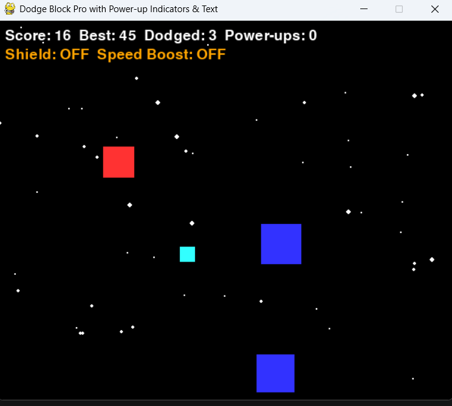
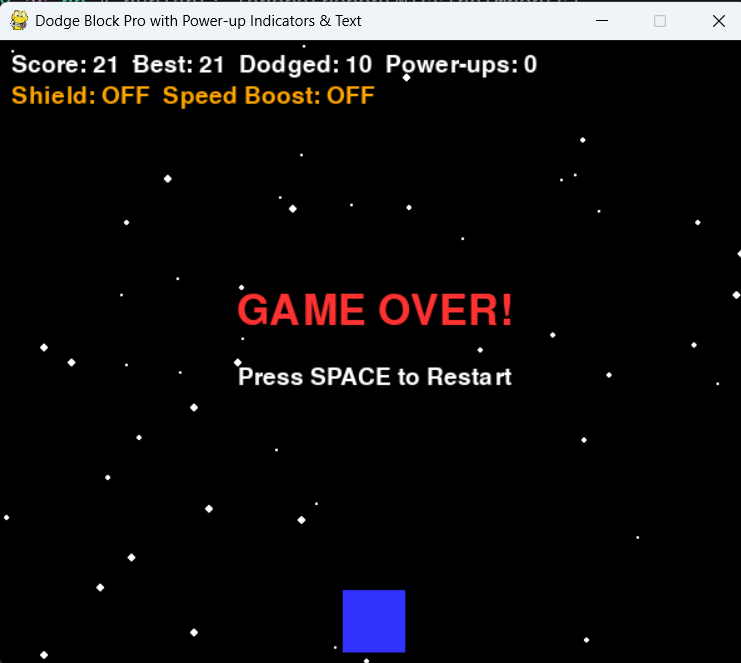

# Dodge Block Game

A simple 2D arcade game developed using **Python** and **Pygame**. The player controls a character and must dodge falling blocks to survive as long as possible. The game includes smooth movement, collision detection, score tracking, and increasing difficulty.

## Features

- Smooth player movement
- Random falling obstacles
- Collision detection
- Real-time score tracking
- Increasing game difficulty
- Clean and interactive gameplay

## Technologies Used

- Python
- Pygame
- NumPy

## Project Structure

```
dodge-block-game/
│── main.py
│── requirements.txt
│── README.md
│── screenshots/
```

## Installation

1. Clone the repository

```bash
git clone https://github.com/YashSingh2210/dodge-block-game.git
```

2. Move into the project folder

```bash
cd dodge-block-game
```

3. Install dependencies

```bash
pip install -r requirements.txt
```

4. Run the game

```bash
python main.py
```

## Screenshots

### Gameplay



### Game Over




## Future Improvements

- Add multiple levels
- Sound effects and background music
- High score system
- Pause and Resume option
- Better animations

## Author

**Yashovardhan Singh**
